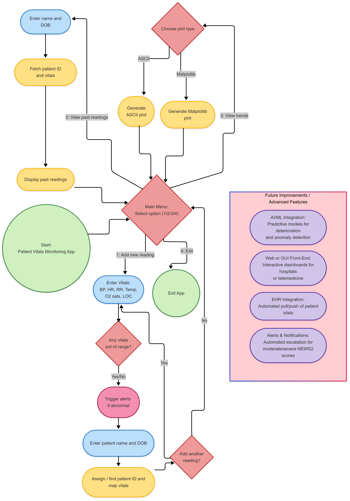
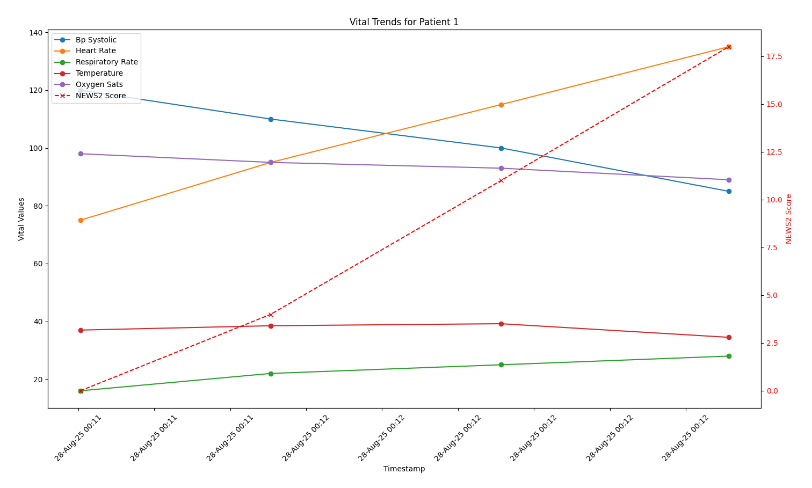
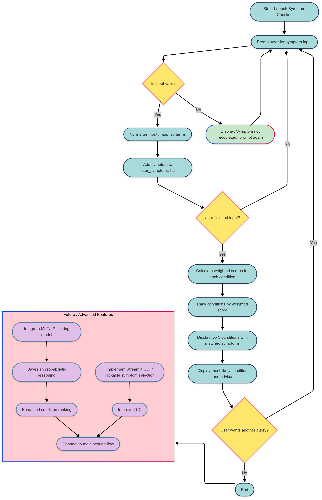

## 👤 About Me
<!--
 
 
 
 
 

-->

### 📝 Summary
- Clinician-technologist combining medical training (MBBS) with technical proficiency (MS Computer Science with Artificial Intelligence), focused on leveraging AI/ML and clinical expertise to optimise digital health innovation through data-driven solutions. 
- I specialise in healthcare technology pipelines with clinically-informed end-to-end deployments, combining Python, ML, Deep Learning, NLP, and data science to build tools and models that are technically robust and medically interpretable.
- My goal is to continue to develop, validate, and deploy intelligent healthcare solutions that improve patient outcomes, streamline clinical workflows, and integrate predictive decision support into real-world clinical settings. 

##
### 🎓 Education
- **_Master of Science (MS) - Computer Science with Artificial Intelligence_** [City St George's, University of London](https://www.citystgeorges.ac.uk)
- **_Bachelor of Medicine, Bachelor of Surgery (MBBS) - Medicine_** [Norwich Medical School](https://www.uea.ac.uk/about/norwich-medical-school)

##
### 🛠️ Technical Skills

  
  
  
  
  
  
  
  
  
  

- 🖥️ **_Programming & Software Engineering:_** Python, OOP, Git/GitHub, Unit testing, Modular Design, CI/CD  
- 🦾 **_AI & ML:_** PyTorch, Temporal Convolutional Network (TCN), LightGBM, Scikit-learn, NLP, Time-series modeling, Feature Engineering, Rule-based AI
- 📊 **_Data Handling & Visualisation:_** Pandas, NumPy, Matplotlib, ASCII charts, Healthcare Analytics (Tabular EHR/ICU data, longitudinal patient data)
- 🩻 **_Clinical Systems & Standards:_** EHRs (ICE, SystmOne, MediViewer), NEWS2, FHIR-HL7, GDPR
- 🌐 **_Web & API:_** FastAPI, Render, Pydantic (data validation), Uvicorn (ASGI server)
##
### 🚀 Portfolio Projects
#### ⚡️ _Current Projects_
- 📉⏳ [Neural Network (TCN) ICU Patient Deterioration Predictor](https://github.com/SimonYip22/EWS-Predictive-Dashboard)
- 🫀📊 [NEWS2 Vitals Tracker with Alerts, Monitoring & Visualisation](https://github.com/SimonYip22/Vitals-Tracker-CLI)
- 🧠🤖 [Rule-Based AI Symptom Checker](https://github.com/SimonYip22/AI-Symptom-Checker)
#### 🔮 _Future Projects_
- 🧬⚖️ [[Final Project] Deep-Learning/NLP Clinical Decision Support Tool (CDST)](https://github.com/SimonYip22/AI-Clinical-Decision-Support-Tool) 
- 📑🧩 [NLP Unstructured Free-Text Clinical Findings (EHR) Extractor](https://github.com/SimonYip22/NLP-Clinical-Notes-Extractor)
##
### 💡 Interests
- 💻 **_Technical:_** AI & ML in Medicine, Digital Health, Data Science
- 🥼 **_Clinical:_** Healthcare Product Management, Clinical Informatics, Healthcare Consulting
##
### 🔬 Audits & Research
#### 📂 _Research_
- Lacertus syndrome and its surgical management using WALANT - our first 12 cases (Research Poster)
- Giant trichoblastic carcinoma initially misdiagnosed as basal cell carcinoma (Case Report Manuscript)
#### 📋 _Audits_
- Head and Neck Surgery, Integrated Care Pathway Surgical Proforma Audit

##

  
  

##

<!--
## 🎖️ Featured Projects

### 🫀📉 NEWS2 Vitals Tracker with Alerts, Monitoring & visualisation (CLI & FastAPI)
[GitHub Repo](https://github.com/SimonYip22/Vitals-Tracker-CLI) | [Live API](https://vitals-tracker-cli.onrender.com/docs)

A **Python-based CLI & FastAPI tool** for **multi-patient vitals monitoring**, **real-time NEWS2 scoring**, tiered clinical alerts, and trend visualisation (ASCII & Matplotlib). Designed with **clinically-informed logic**, GDPR-compliant patient management, and longitudinal tracking.  

Supports clinicians in real-time monitoring, reduces risk of missed deterioration, and can integrate into hospital EHRs.

**Highlights:**
- 🏥 Clinically-informed input handling for patient vitals with validation  
- 📊 **Full vitals capture**: BP, HR, RR, Temp, O₂ sats, Level of Consciousness  
- 🚨 Tiered NEWS2 scoring and alerts aligned with **clinical decision thresholds** (Normal → Mild → Moderate → Severe)
- 💻 **Dual interface**: **Command-line tool** + **FastAPI JSON API (live on Render)** 
- ❓ Patient ID anonymisation for GDPR-compliant longitudinal multi-patient tracking
- 🔄 **Continuous Integration (GitHub Actions)** validates API endpoints weekly and on push
- 📈 Portfolio-ready trend visualisation with ASCII charts and **Matplotlib plots**  
- 🧩 Modular architecture supporting **future AI/ML predictive extensions**  

**Workflow Overview:**  

*Figure 2: CLI & API patient vitals tracking workflow with NEWS2 scoring, alert logic, and trend visualisation.*

**Example Matplotlib Plot:**  

*Figure 3: Dual-axis Matplotlib plot of patient vitals over time with NEWS2 scores. Clinically-informed alerts are highlighted, demonstrating portfolio-ready visualisation and interpretation.*

##

### 🧠🤖 Rule-Based AI Symptom Checker (CLI & FastAPI)
[GitHub Repo](https://github.com/SimonYip22/AI-Symptom-Checker) | [Live API](https://ai-symptom-checker-5rfb.onrender.com)

A **Python-based, rule-driven AI symptom checker** that leverages clinical reasoning to interpret patient-reported symptoms and rank potential conditions. Users can interact via a **command-line interface (CLI)** or a **FastAPI-based JSON API (v2)**, making the tool both scriptable and deployable for web integration.

Unlike generic AI tools, this project encodes **doctor-level clinical reasoning**, where condition-symptom mappings, input normalisation and formula-weighted scoring reflect real-world clinical prioritisation.

**Highlights:**
- 🏥 Clinically-informed input handling for lay-language symptoms  
- ⚖️ Rule-based inference with **formula-weighted scoring** ensuring interpretable, relevant outputs  
- 💻 **Dual interface**: **Command-line tool** + **FastAPI JSON API (live on Render)**  
- 🔄 **Continuous Integration (GitHub Actions)** validates API endpoints weekly and on push  
- 🧩 Modular architecture, future-ready for **ML/NLP integration and frontend expansion**  

**Workflow Overview:**  

  
*Figure 1: Rule-based AI symptom checker workflow showing symptom input, weighted scoring, and top condition output with advice.*

---
-->
