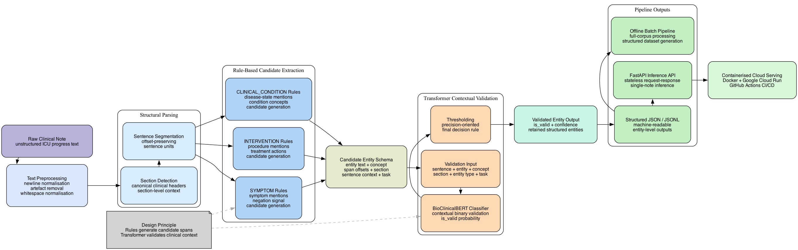

# Simon Yip

MBBS and Machine Learning Engineer building end-to-end clinical systems across time-series modelling and NLP using large-scale medical datasets

Currently contributing to large-scale ML research workflows at RadNomics involving LLM-based radiology report generation and model evaluation

  

  

## Featured Projects

### Clinical Entity Extraction-Validation System

_Python | PyTorch | Hugging Face | scikit-learn | pandas | FastAPI | Docker | Google Cloud Run | GitHub Actions_

- Hybrid clinical NLP system generating structured entity outputs from adult ICU progress notes
- Implemented rule-based regex extraction schemas for recall-focused extraction of **3 clinical entity types**
- **Fine-tuned a BioClinicalBERT classifier on 1000+ manually annotated entities,** and integrated precision-oriented threshold tuning for final entity validation
- **Extracted 780,000+ structured entities** from a preprocessed ICU corpus of **160,000+ notes (30,000+ stays)**
- Transformer validation achieved **+45.9% in precision** and **−83.3% in false positives** relative to rule-only baseline
- Deployed inference pipeline as **stateless, containerised API on Google Cloud Run** with GitHub Actions versioning

[Access Live API](https://clinical-nlp-api-1064509144938.europe-west1.run.app/docs) | [View Repository](https://github.com/SimonYip22/Clinical-Entity-Extraction-Validation-System) | https://doi.org/10.5281/zenodo.20018309

  

### Time-Series ICU Patient Deterioration Predictor  

_Python | PyTorch | LightGBM | scikit-learn | pandas | NumPy_

- Dual-architecture ICU early warning system combining a Temporal CNN (TCN) and LightGBM to predict NEWS2-derived deterioration outcomes across **3 clinical risk dimensions**
- Transformed clinical data across **140 ICU stays** using CO2 retainer logic, GCS mapping, and oxygen protocols
- **Engineered 171 timestamp-level features (8 vital parameters; 96-hour windows)** and **40 aggregated patient-level features** from **70,000+ extracted time-series observations**
- TCN achieved **+9.3% AUC improvement** for acute-event detection; LightGBM achieved **−68% Brier score and −48% RMSE** for prolonged risk exposure
- Implemented clinician-interpretable SHAP and saliency mapping for feature contribution insights

[View Repository](https://github.com/SimonYip22/Time-Series-ICU-Patient-Deterioration-Predictor) | https://doi.org/10.5281/zenodo.18487174

  

## Professional Experience

**Applied Machine Learning Engineer @ RadNomics Ltd** 

- **Processed 2.3M+ radiology reports** and developed a data augmentation pipeline generating **17M+ report pairs** across **7 clinically relevant reconstruction tasks**
- Ran large-scale ML research workflows in containerised remote environments on **GKE-based cloud infrastructure,** with Git-based collaboration
- Built an LLM benchmarking framework across **6 candidate models,** generating **42,000 reconstructed reports** via provider APIs and evaluating using text and semantic similarity metrics, clincal scoring, and operational performance metrics
- Integrated business insights into system workflows, converting anaylsis into actionable guidance

## Technical Stack

- **Machine Learning:** PyTorch, Scikit-learn, LightGBM, Hugging Face Transformers, Clinical NLP (regex, NLTK), LLM Evaluation
- **DevOps:** Google Cloud Platform (GKE, Cloud Run), Kubernetes, Docker, FastAPI, GitHub Actions (CI/CD)
- **Data & Engineering:** Python, Pandas, NumPy, SQL (PostgreSQL/MySQL), Bash

## Education

- ***MSc, Computer Science with Artificial Intelligence*** @ City St George’s, University of London
- ***MBBS, Medicine*** @ Norwich Medical School, University of East Anglia

## Archives

- _Yip, S. (2026). Clinical Entity Extraction-Validation System (1.0.0). Zenodo. https://doi.org/10.5281/zenodo.20018309_
- _Yip, S. (2026). Time-Series ICU Patient Deterioration Predictor (1.0.0). Zenodo. https://doi.org/10.5281/zenodo.18487174_

## Clinical Experience

_**MBBS Medical Student @ Norwich Medical School, University of East Anglia**_

_**Audit & Research Assistant @ Norfolk and Norwich University Hospital**_

#### _Research_
- Lacertus syndrome and its surgical management using WALANT - our first 12 cases (Research Poster)
- Giant trichoblastic carcinoma initially misdiagnosed as basal cell carcinoma (Case Report)

#### _Audit Cycles_
- Head and Neck Surgery, Integrated Care Pathway Surgical Proforma Audit
- Plastic Surgery, Free Flap Surgical Outcomes Audit

#### _Healthcare Data Skills_
- **Clinical Informatics:** EHR Systems (ICE, SystmOne, MediViewer, EPMA), NEWS2, GDPR Awareness
- **Clinical Research:** Audit Methodology, Literature Review, Critical Appraisal, Manuscript Preparation

##

  
  

##
