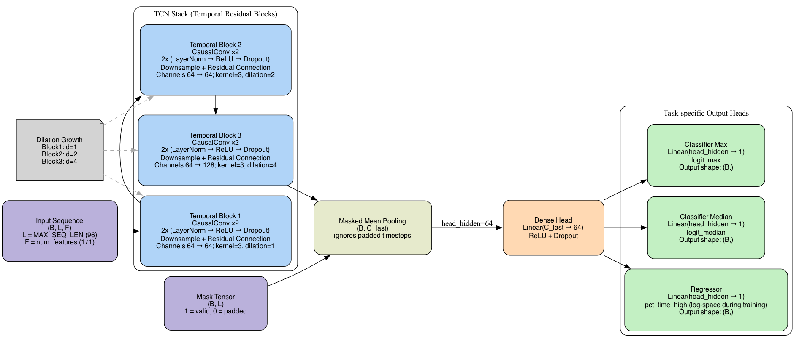

# Simon Yip 葉詠倫

Applied Machine Learning Engineer building end-to-end clinical ML systems across time-series modelling and NLP.
Built and deployed pipelines with PyTorch, LightGBM, and Hugging Face Transformers  

Experience with production-oriented cloud ML workflows (GKE, Kubernetes) at RadNomics  

  

##
### Machine Learning Projects
##

#### Time-Series ICU Patient Deterioration Predictor  
Dual-architecture ML system for early clinical risk prediction using ICU time-series data

- LightGBM (tabular) + Temporal CNN (TCN)
- End-to-end pipeline: preprocessing → feature engineering → training → evaluation → inference  
- SHAP + saliency interpretability

[View Repository](https://github.com/SimonYip22/Time-Series-ICU-Patient-Deterioration-Predictor)

Yip, S. (2026). Time-Series ICU Patient Deterioration Predictor (1.0.0). Zenodo. [https://doi.org/10.5281/zenodo.18487174](https://doi.org/10.5281/zenodo.18487174)

  

##
#### Hybrid Clinical Notes Extraction Pipeline (In Progress)

Clinical NLP system for structured free-text extraction from ICU progress reports

- Rule-based entity extraction + transformer-based BioClinicalBERT validation
- Deployed end-to-end inference pipeline as stateless, containerised API on GCP Cloud Run (FastAPI + Docker + CI/CD)

[View Repository](https://github.com/SimonYip22/Hybrid-Clinical-Notes-Extraction-Pipeline)

##
### Experience
##

**Applied Machine Learning Engineer — RadNomics Ltd**  
- Operated ML workflows in Kubernetes-based cloud infrastructure (GKE), for large-scale clinical NLP pipeline
- Medical data cleaning, preprocessing, and feature engineering for downstream LLM building

##
### Technical Stack
##

- 🦾 **Machine Learning:** PyTorch, Scikit-learn, LightGBM, Hugging Face Transformers
- ☁️ **Cloud / Infra:** Google Cloud Platform (GKE, Cloud Run), Kubernetes, Docker
- 🖥️ **Software Engineering:** Python, FastAPI, Git/GitHub, CI/CD (GitHub Actions)
- 📊 **Data:** Pandas, NumPy

##
### Education
##
- MSc Computer Science with Artificial Intelligence — City St George’s, University of London  
- MBBS Medicine — Norwich Medical School 

## 
### Publications
##
- Yip, S. (2026). Time-Series ICU Patient Deterioration Predictor (1.0.0). Zenodo. [https://doi.org/10.5281/zenodo.18487174](https://doi.org/10.5281/zenodo.18487174)

##
### Clinical Work
##

**Audit & Research Assistant — Norfolk and Norwich University Hospital**

#### _Research_
- Lacertus syndrome and its surgical management using WALANT - our first 12 cases (Research Poster)
- Giant trichoblastic carcinoma initially misdiagnosed as basal cell carcinoma (Case Report)

#### _Audits_
- Head and Neck Surgery, Integrated Care Pathway Surgical Proforma Audit

#### 🥼 _Healthcare Data Skills_
- 🩻 **Clinical Informatics:** EHR Systems (ICE, SystmOne, MediViewer, EPMA), HL7-FHIR, NEWS2, GDPR
- 🔬 **Clinical Research:** Audit Methodology, Literature Review, Critical Appraisal, Manuscript Preparation

##

  
  

##
